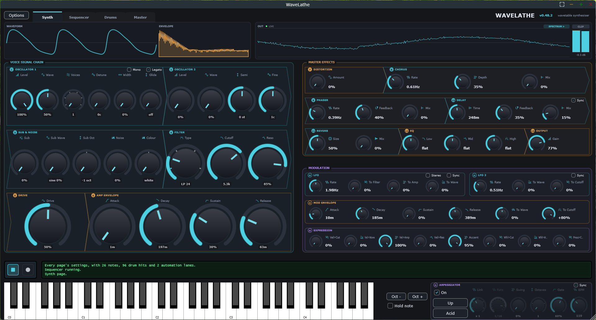

# WaveLathe

[](https://github.com/mrdatacommando/WaveLathe/actions/workflows/build.yml)

A wavetable synthesiser, drum machine and mastering chain for Windows, as VST3
plugins and standalone applications. Free and open source, under the
[GNU AGPL v3](LICENSE).



WaveLathe is two products built from one source tree:

- **WaveLathe** is the instrument. It has a two-oscillator wavetable synth, a
  step sequencer, a twelve-slot drum machine, bus effects and a mastering
  chain. A sound matcher can fit a patch to a recording you give it.
- **WaveLathe Master** is the same mastering chain as an effect plugin, for a
  mix bus.

Status: **beta**. It is built and tested on Windows 10 and 11, 64-bit. There is
no macOS or Linux build yet.

## Download

<!-- download:start -->
**[Download WaveLathe 0.49.0 for Windows](https://github.com/mrdatacommando/WaveLathe/raw/main/Releases/WaveLathe-0.49.0-win64.zip)** - one zip, 15.1 MB,
holding both standalones, both VST3 plugins and the user guide. The
[checksums](Releases/WaveLathe-0.49.0-win64.sha256.txt) are beside it.
<!-- download:end -->

You don't need a GitHub account or git. The link downloads a ready-built copy.
The zip holds both standalones, both VST3 plugins, the user guide as a PDF, the
licence and the third-party notices. Nothing else needs installing: the C++
runtime is built into every file. The [changelog](CHANGELOG.md) lists what
changed in each version.

To install the standalone, put `WaveLathe.exe` anywhere and run it. Then open
**Options → Audio / MIDI Settings** and choose your output device. Until you
do, you may hear nothing.

To install the plugins, copy the `.vst3` folders into the folder your host
scans. On Windows that is normally `C:\Program Files\Common Files\VST3\`, which
needs administrator rights. Most hosts can also scan a folder of your own.
WaveLathe shows up as an instrument and WaveLathe Master as an effect.
WaveLathe has been tested in Ableton Live 12 Lite.

WaveLathe isn't code-signed, so Windows SmartScreen may say *"Windows
protected your PC"* the first time you run it. Choose **More info → Run
anyway**.

## What's in it

The [user guide](Docs/WaveLathe-User-Guide.pdf) covers every control. In
short:

**Synth page.** Two wavetable oscillators with unison, a sub oscillator and
noise. A multi-mode filter with its own envelope, two LFOs, a second envelope,
and velocity, mod wheel and aftertouch as sources. Glide and legato in both
mono and poly. The synth has its own effects: distortion, chorus, phaser,
delay, reverb and EQ.

**Arpeggiator and Play in Key.** 24 note orders, separate rhythm patterns,
swing, and up to three octaves. Play in Key keeps what you play in a key and
scale, with a chord mode.

**Sequencer page.** A piano roll for the synth and a step grid for the drums,
with velocity, chance, ties, slides and accents. There are automation lanes, a
pattern generator, and undo across the whole project.

**Drums page.** Twelve slots, each loaded with one of sixteen synthesised drums
or a sample of your own. Every slot has level, attack, decay, tune and pan,
plus two effect sends into a shared rack of reverb, distortion, EQ and delay.

**Master page.** The synth's effects a second time, over the whole mix. After
them comes a mastering chain: saturation, a compressor and a limiter.

**Sound matching.** Load a WAV and WaveLathe builds a patch that sounds like
it. Quick Match picks the closest factory preset. Deep Match then fits the
parameters across several notes of the recording. Matching only analyses the
audio you supply. WaveLathe doesn't read other synthesisers' preset files.

**In a DAW.** 171 automatable parameters. Tempo and transport come from the
host. There's MIDI learn, a MIDI map, a MIDI monitor, and a separate MIDI
channel for the drums.

It ships with **65 factory presets**, levelled to a consistent loudness.

## Building from source

You need:

- Windows 10 or 11, 64-bit
- Visual Studio 2022 with the **Desktop development with C++** workload
- CMake 3.22 or later
- Git, and an internet connection for the first configure

```
git clone https://github.com/mrdatacommando/WaveLathe.git
cd WaveLathe
cmake -S . -B build -G "Visual Studio 17 2022" -A x64
cmake --build build --config Release
```

The first configure downloads [JUCE](https://github.com/juce-framework/JUCE)
9.0.1, which the build fetches itself. There's nothing to install separately.
The first build takes a while.

The binaries land in:

| Product | Where |
|---|---|
| WaveLathe | `build\WaveLathe_artefacts\Release\Standalone\` and `…\VST3\` |
| WaveLathe Master | `build\WaveLatheMaster_artefacts\Release\Standalone\` and `…\VST3\` |

The build doesn't copy anything into your system VST3 folder. Point your host
at the `VST3` folder above instead, and it picks up each rebuild in place.

### Tests

```
powershell -ExecutionPolicy Bypass -File Tools\run-tests.ps1
```

This builds and runs all 21 test suites and prints one verdict. Each suite is
a console application in `Tests\` that returns 0 when it passes.

### Other tools

| Script | What it does |
|---|---|
| `Tools\make-guide.ps1` | Rebuilds the guide PDF from `Docs\WaveLathe-User-Guide.html` using Chrome or Edge. |
| `Tools\make-release.ps1` | Packages a Release build into `dist\` as a zip with checksums. It refuses a stale or mis-versioned build. |

### Layout

| Folder | What's there |
|---|---|
| `Source\` | Both products. Drum engines are in `Drums\`, the mastering chain in `Mastering\`, the effect plugin in `MasterPlugin\`. |
| `Tests\` | The test suites. |
| `Analysis\` | Command-line tools for analysing audio and presets during development. |
| `Docs\` | The user guide and its screenshots, plus design notes. |
| `Packaging\` | The read-me that goes into the release zip. |

The version is set in two places: `Source\Version.h` and `project()` in
`CMakeLists.txt`. The history of every release is in [CHANGELOG.md](CHANGELOG.md).

## Licence

WaveLathe is free software. You can redistribute and modify it under the terms
of the **GNU Affero General Public License, version 3 or (at your option) any
later version**. The full text is in [LICENSE](LICENSE).

In plain terms:

- **Use it for anything.** That includes paid, commercial music. There's no fee
  and no registration.
- **What you make is yours.** The licence covers WaveLathe's code, not the
  sounds, presets, patterns, projects or recordings you make with it. You owe
  nothing for them and need no permission to release or sell them.
- **Share it, change it.** If you give someone a copy, or a modified version,
  you must also offer them its source code, under this same licence. This is
  what keeps WaveLathe and every version made from it free.
- **No warranty.** It comes as is. Save your work often.

This covers every earlier version of WaveLathe too, including copies shared
before its source was published. All of them are offered under the same
licence.

WaveLathe is built with [JUCE](https://juce.com), which it uses under the
AGPLv3. It also includes the VST 3 SDK and the other components listed in
[THIRD_PARTY_NOTICES.txt](THIRD_PARTY_NOTICES.txt), each under its own
licence.

## Contributing

Bug reports, fixes and ideas are welcome. See [CONTRIBUTING.md](CONTRIBUTING.md).

Report bugs and ask questions in
[Issues](https://github.com/mrdatacommando/WaveLathe/issues).

For a crash, the most useful thing to attach is the dump Windows writes to
`%LOCALAPPDATA%\CrashDumps`. Look for a file named `WaveLathe.exe.<number>.dmp`
with a time close to the crash. Zip it first, because GitHub won't accept a
`.dmp` file as it is.

---

VST is a registered trademark of Steinberg Media Technologies GmbH. WaveLathe
is not affiliated with, nor endorsed by, Steinberg Media Technologies GmbH or
Raw Material Software Limited.
